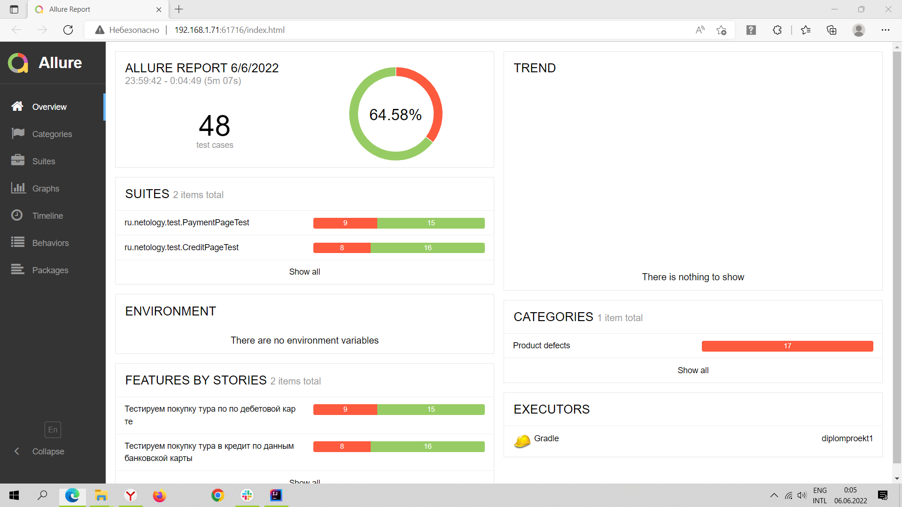
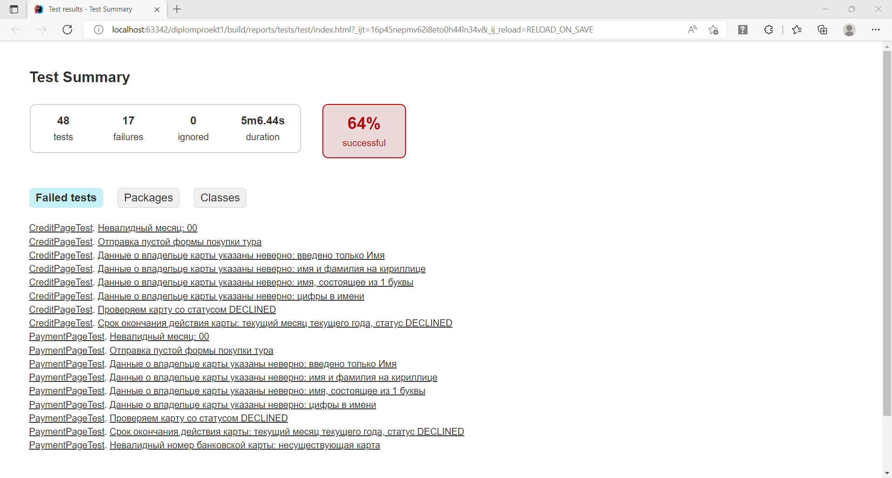

# Отчёт о проведённом тестировании

1. Краткое описание
   В ходе выполнения дипломной работы было проведено тестирование веб-сервиса "Путешествие дня", 
которое представляет из себя комплексный сервис, взаимодействующий с СУБД и API Банка.

- На первом этапе было проведено исследовательное, мануальное тестирование и составлен план автоматизации (Plan.md)
- На втором этапе была произведена автоматизация тестирования
- На третьем этапе был сгенерирован отчет о проведенном тестировании

2. Количество тест-кейсов
- Всего тест-кейсов: 48
- Всего успешных тест-кейсов: 31
- Всего не успешных тест-кейсов: 17

3. Процент успешных/не успешных
- Всего успешных тест-кейсов: 64.58%
- Всего не успешных тест-кейсов: 35.42%

4. Общие рекомендации

Устранить дефекты обнаруженные на этапе тестирования - https://github.com/Anna-64/diplomproekt1/issues

